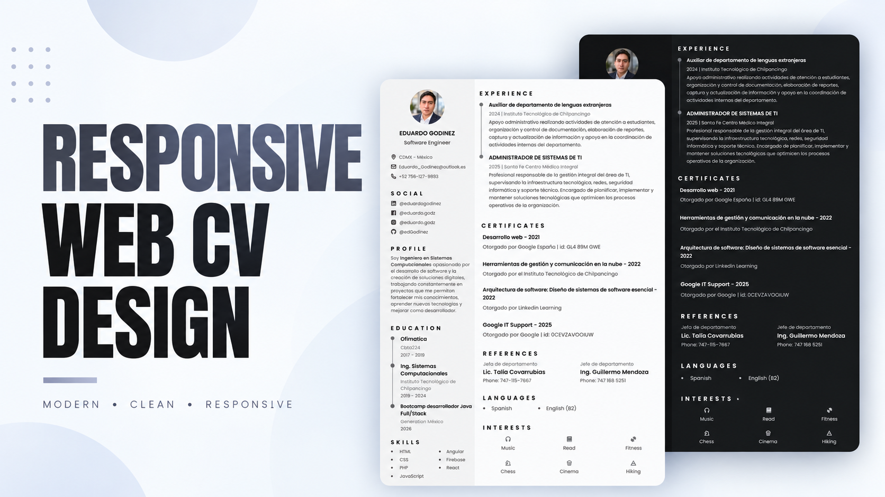

# 📄 Responsive Web CV

Currículum vitae web desarrollado para presentar de forma clara, moderna y responsive mi perfil profesional, experiencia, educación, habilidades, idiomas, intereses e información de contacto.

El proyecto está diseñado para funcionar correctamente en computadoras, tablets y dispositivos móviles, además de permitir la generación y descarga del CV en formato PDF directamente desde el navegador.

🌐 **Live Demo:**
https://edgodinez.github.io

---

## 📸 Preview



---

## ✨ Features

* Diseño responsive para distintos tamaños de pantalla.
* Navegación dinámica entre secciones.
* Modo claro y oscuro.
* Perfil profesional.
* Información de contacto.
* Experiencia laboral.
* Formación académica.
* Habilidades técnicas y profesionales.
* Idiomas.
* Intereses personales.
* Enlaces a redes profesionales.
* Navegación activa según la sección visible.
* Animaciones durante el desplazamiento.
* Generación y descarga del CV en formato PDF.
* Publicación mediante GitHub Pages.

---

## 🛠️ Technologies

El proyecto fue desarrollado utilizando:

* **HTML5**
* **CSS3**
* **JavaScript**
* **Boxicons**
* **ScrollReveal**
* **html2pdf.js**
* **Git**
* **GitHub**
* **GitHub Pages**

---

## 📂 Project Structure

```text
EdGodinez.github.io/
│
├── assets/
│   ├── css/
│   ├── img/
│   ├── js/
│   └── ...
│
├── index.html
├── preview.png
├── README.md
└── .gitignore
```

---

## 🚀 Run Locally

Clona el repositorio:

```bash
git clone https://github.com/EdGodinez/EdGodinez.github.io.git
```

Entra al directorio del proyecto:

```bash
cd EdGodinez.github.io
```

Después puedes abrir directamente:

```text
index.html
```

También puedes utilizar una extensión como **Live Server** en Visual Studio Code para ejecutarlo mediante un servidor local.

---

## 📱 Responsive Design

La interfaz fue diseñada para adaptarse a diferentes resoluciones y dispositivos:

* 💻 Desktop
* 📟 Tablet
* 📱 Mobile

La navegación y distribución del contenido cambian según el tamaño de la pantalla para mantener una experiencia cómoda y legible.

---

## 📄 PDF Generation

El CV incluye una funcionalidad para generar una versión descargable en formato PDF directamente desde el navegador.

Para ello se utiliza **html2pdf.js**, junto con estilos específicos que adaptan temporalmente el diseño web al formato del documento.

---

## 🌙 Dark Mode

La aplicación incluye soporte para modo claro y oscuro, permitiendo cambiar la apariencia de la interfaz manteniendo la legibilidad del contenido.

---

## 🌐 Deployment

El proyecto está publicado mediante **GitHub Pages**.

La versión disponible públicamente puede consultarse en:

https://edgodinez.github.io

Las actualizaciones realizadas en la rama principal del repositorio se reflejan posteriormente en el sitio publicado.

---

## 👨‍💻 Author

**Eduardo Godínez**

Ingeniero en Sistemas Computacionales con interés en desarrollo de software y tecnologías web.

* GitHub: [@EdGodinez](https://github.com/EdGodinez)
* Web CV: [edgodinez.github.io](https://edgodinez.github.io)

---

## 📜 License

Este proyecto fue desarrollado como un currículum vitae web personal.

El código puede utilizarse como referencia con fines educativos y de aprendizaje.
